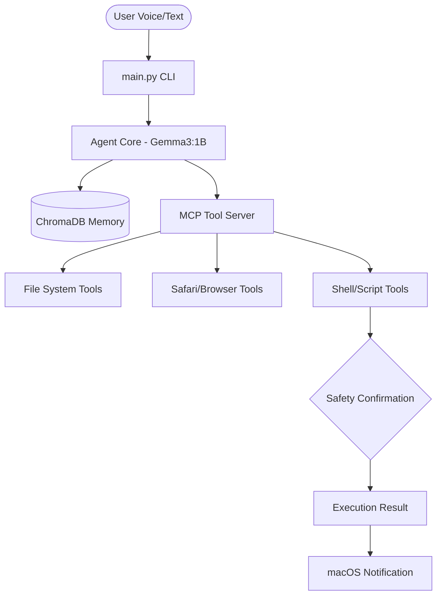

# 🧭 macOS Agentic AI

> **A persistent, context-aware, and multi-modal autonomous agent specifically engineered for macOS automation.**


-blue?style=for-the-badge)


---

## ✨ Features

### 🎙️ Multi-Modal Input
Talk directly to your system. Integrated with **SpeechRecognition** and a background listener thread, the agent can understand complex spoken intents.

### 🧠 Semantic Long-Term Memory
Powered by **ChromaDB**, the agent remembers your projects, previous errors, and personal preferences. It learns from its mistakes in real-time.

### ⛓️ Multi-Step Reasoning
Doesn't just run one tool. It builds a **logical execution plan** to solve multi-stage tasks like *"Create a project folder on my desktop, initialize git, and open it in VS Code."*

### 🛡️ Built-in Safety Loop
High-risk actions (like deleting folders or running shell commands) trigger **Native macOS Notifications** and require explicit terminal confirmation (`y/N`).

### 🎯 High-Precision macOS Tools
- **Deep Browser Integration**: Safari Private Mode, YouTube specific searching, and URL navigation.
- **Smart Pathing**: Automatically resolves `Desktop`, `Documents`, and `~` aliases to your absolute home directory.
- **Protocol Focused**: Refactored to use the **Model Context Protocol (MCP)** for standardized tool execution.

---

## 🚀 Quick Start (macOS Only)

### 1. Prerequisites
- [Ollama](https://ollama.com) installed and running.
- Python 3.10+ installed.

### 2. One-Click Installation
Clone the repo and run the installer. It will handle system dependencies, virtual environments, and the background daemon.

```bash
git clone https://github.com/your-username/macos-agentic-ai.git
cd macos-agentic-ai
chmod +x install.sh
./install.sh
```

### 3. Usage
Run the interactive console:
```bash
source venv/bin/activate
python3 main.py
```
- Type **`voice`** to start the background listener.
- Speak naturally: *"Open Safari in incognito and go on YouTube."*

---

## 🏗️ Architecture



---

## 📜 License
MIT License. Created with ❤️ for macOS Automation.
