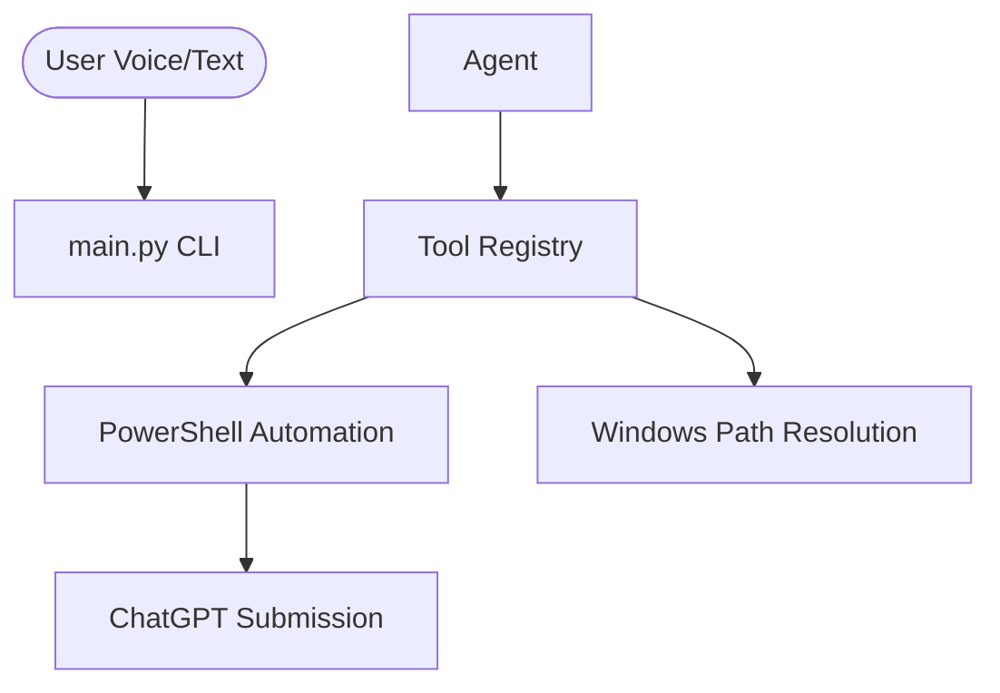

# 🧭 Windows Agentic AI (windows-v1)

> **A persistent, context-aware autonomous agent engineered for Windows automation via PowerShell and CMD.**


-blue?style=for-the-badge)

---

## 🚀 Quick Start (Windows)

### 1. Prerequisites
- [Ollama](https://ollama.com) installed and running.
- Python 3.10+ installed.

### 2. One-Click Installation
Open **PowerShell as Administrator** and run:
```powershell
Set-ExecutionPolicy RemoteSigned -Scope CurrentUser
git clone -b windows-v1 https://github.com/ankitxrishav/Context-Aware-Agentic-OS-Assistant.git
cd Context-Aware-Agentic-OS-Assistant
.\setup_windows.ps1
```

### 3. Usage
```powershell
.\venv\Scripts\Activate.ps1
python main.py
```

---

## 🔥 Features
- **PowerShell Automation**: Seamless control of Windows services and UI.
- **ChatGPT Deep Integration**: Opens ChatGPT and automatically types/submits queries.
- **Always-Listening Filter**: Intelligent voice noise classification.
- **Semantic Memory**: Remembers your preferences and command history.

---

## 🏗️ Architecture (Windows)

